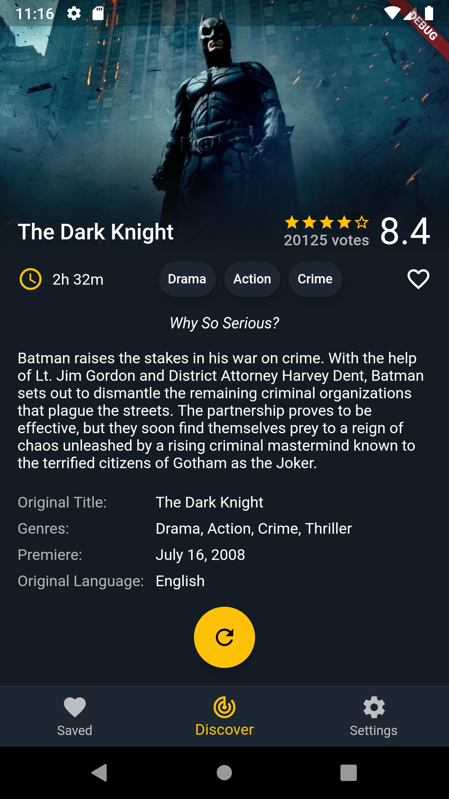
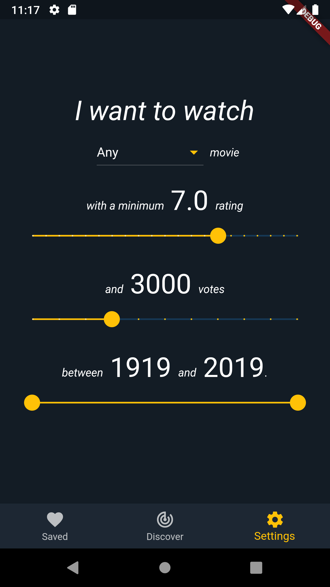

# Unreel

Unreel is a movie app made with Flutter that gives the user recommendations for movies to watch depending on their input.

## Features

* View detailed but carefully laid out information about the movies you are recommended.
* Choose which kinds of movies you want to get recommended. Choose your preferred genre, release year, minimum rating and number of votes to get movie recommendations relevant to you.
* Save interesting movies to your local watch list to access them later. Data is saved locally in an SQLite database and images are stored in the device's local files to reduce network usage and enable offline access of saved movies.
* Seemingly instant UI updates even when loading network content. Data for the next movie in the queue is fetched one click ahead, and the next backdrop image is precached to allow the user to see their next movie as soon as they press the button.

## Unreel in Action

## Screenshots

